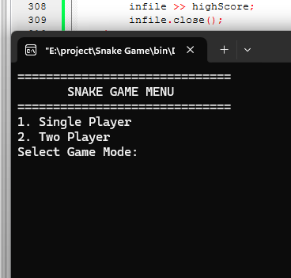
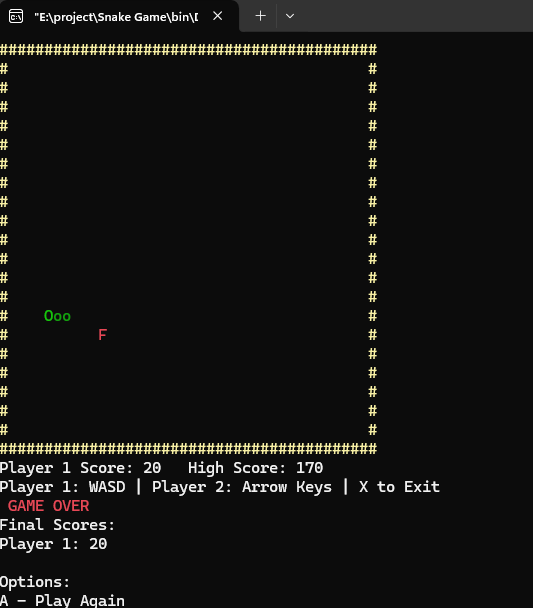
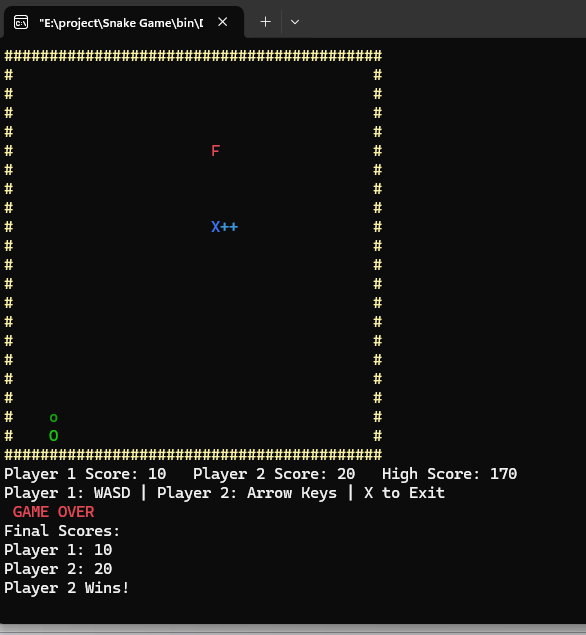

# Snake Game (C++)

🎮 Classic terminal Snake game with tail growth and both **Single** & **Two Player** modes.

## 📸 Screenshots

**Main Menu**  

**Single Player Mode**  

**Two Player Mode**  

## 🎮 Features
-  Tail grows when fruit is eaten
- 👥 Two-player mode (WASD + Arrow Keys)
- 🔁 Back to main menu after each game
- 💾 High score saved to file

## 🕹️ Controls
- Player 1: W A S D
- Player 2: Arrow Keys
- X: Exit game

## ⚙️ How to Compile
- Open `main.cpp` in Code::Blocks
- Build & Run
- Make sure `highscore.txt` exists in the same folder

